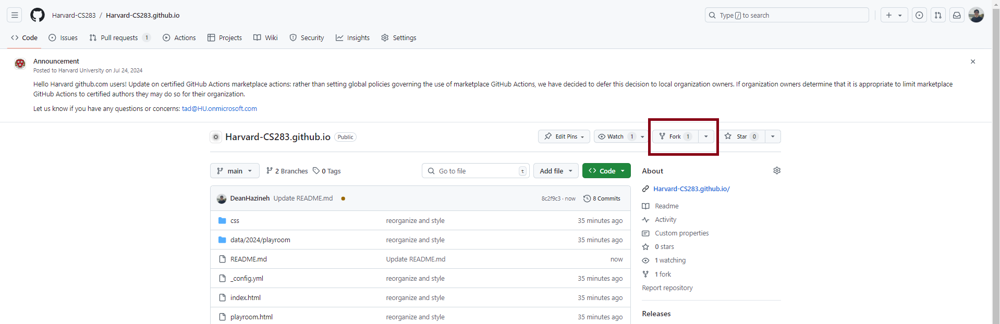
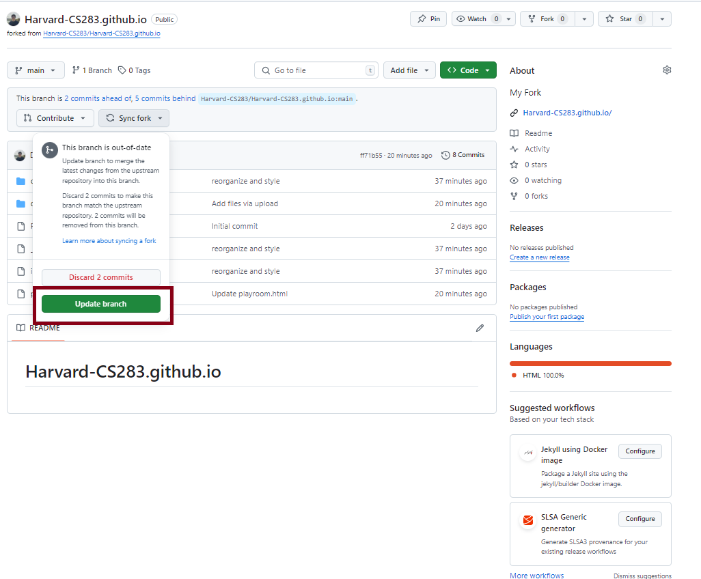
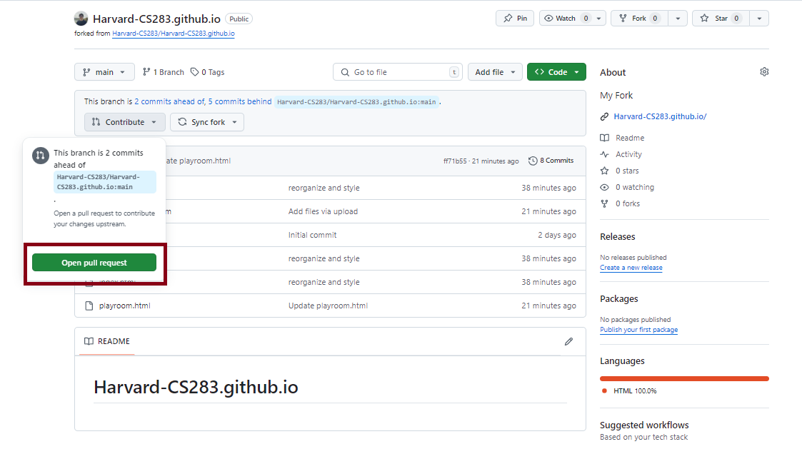

# Harvard-CS283.github.io

## Instructions for how to commit your work to this site:

- **(1) Fork this repository.**
  
  

- **(2) Go to the forked repository which is now in your account homepage. Always sync your forked version first in case it is stale.**
  
  

- **(3) Commit your edits directly to your forked repository.**
  - This will typically involve two steps:
    - Add your data file in the appropriate location in the `data` folder.
    - Edit some lines in one of the `.html` page files.

- **(4) Create a pull request to put your changes into this main site.**
  
  

- **(5) Class staff will approve your pull request shortly after.**

